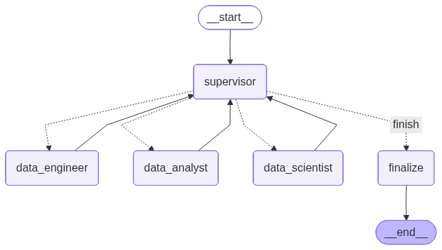

# AI-агент: автономный ML-пайплайн (HSE GP3)

Мульти-агентная система, которая автономно проходит весь ML-цикл:
загрузка → очистка → EDA → feature engineering → обучение моделей → оценка → отчёт.

Каждый агент пишет код в Jupyter-ноутбук, выполняет его, читает результаты, чинит ошибки,
и сабмитит работу внутреннему супервизору. Главный супервизор оркестрирует трёх ролевых
агентов и при необходимости отправляет на retry.

## Бизнес-задача

Бинарная классификация мошеннических вакансий на HR-площадке (`fraudulent`).

Датасет:
[Real / Fake Job Posting Prediction (Kaggle)](https://www.kaggle.com/datasets/shivamb/real-or-fake-fake-jobposting-prediction?resource=download)
— `data/raw/fake_job_postings.csv`, 17 880 строк × 18 признаков, дисбаланс ~5% / 95%.

## Архитектура

### Главный граф

`SUPERVISOR ⇄ DATA_ENGINEER / DATA_ANALYST / DATA_SCIENTIST → FINALIZE`



Главный супервизор маршрутизирует между тремя агентами по их отчётам и фидбеку, по
окончании передаёт работу в ноду `FINALIZE`, которая собирает финальный отчёт.

### Под-граф каждого агента

Шаблон для всех трёх агентов одинаковый:
`CREATE_NOTEBOOK → TOOLS → FIX/<role> → SUPERVISOR → SUBMIT`.

- `CREATE_NOTEBOOK` — LLM с structured-output `Plan` собирает ноутбук (cells + md_report).
- `TOOLS` — кастомная нода (`common/tools_node.py`): выполняет `tool_calls` (build_notebook
  / edit_cell / delete_cell), затем сама запускает `session.execute_all()` и пишет
  результаты в `state.results`. Заменяет старую `EXECUTE`-ноду.
- `FIX` — LLM с `bind_tools(edit_cell)`, видит снимок ноутбука с stderr и чинит упавшие
  ячейки. Зацикливается через TOOLS, пока ячейки не починены.
- `ANALYZE` (DA) / `EVALUATE` (DS) — LLM со structured-output (`AnalysisOutput` /
  `EvaluationOutput`), смотрит снимок ноутбука и пишет insights/recommendations или
  выставляет `submit_error`, если работа не пригодна к сабмиту.
- `TUNE` (только DS) — опциональный шаг: если evaluate решил `should_tune`, LLM редактирует
  ячейки для попытки улучшения метрик.
- `SUPERVISOR` — внутренний QC: LLM со structured-output `SupervisorDecision` принимает или
  отклоняет работу, до 2 QC-циклов на агента.
- `SUBMIT` — пишет `report.md` и собирает `*Report` pydantic-модель из state.

Диаграммы:
[data_engineer](data/architecture/data_engineer_graph.png),
[data_analyst](data/architecture/data_analyst_graph.png),
[data_scientist](data/architecture/data_scientist_graph.png).

### Память

- **Кратковременная** — pydantic-state каждого агента (`DEState` / `DAState` / `DSState`):
  iteration counters, results, plan, last_ai_message, fix_attempts, validated_metrics и т.д.
- **Долговременная** — `data/memory/best_model.pkl` + `data/memory/best_metrics.json`.
  При следующем запуске MultiAgent читает прошлый best и пробрасывает в state как
  `previous_best`; DS должен сравнить с новой моделью и обновить только если лучше.

## Стек

- Python 3.13, [uv](https://github.com/astral-sh/uv) для зависимостей
- LangGraph (графы агентов) + LangChain (LLM-обёртки, tool-calling, structured output)
- OpenAI (`gpt-4.1-mini` по умолчанию, конфигурируется per-role в `configs/config.py`)
- pandas / numpy / scikit-learn / xgboost / lightgbm — ML
- plotly — графики (DA пишет фигуры в `FIGS = []`, NotebookSession сохраняет в HTML)
- nbformat — генерация .ipynb

## Запуск

1. Положить `OPENAI_API_KEY` в `.env` (см. `.env.dist`).
2. Установить зависимости:
   ```bash
   uv sync
   ```
3. Запустить пайплайн:
   ```bash
   uv run python main.py
   ```

## Артефакты

- `data/processed/cleaned.csv` — очищенный датасет от Data Engineer
- `data/processed/features.csv` — датасет с фичами от Data Scientist
- `data/memory/best_model.pkl`, `data/memory/best_metrics.json` — лучшая модель и метрики
- `data/reports/data_engineer.ipynb`, `data/reports/data_analyst.ipynb`,
  `data/reports/data_scientist.ipynb` — рабочие ноутбуки агентов
- `data/reports/<agent>/report.md` — markdown-отчёт каждого агента
- `data/reports/data_analyst/figures/*.html` — все построенные plotly-графики
- `data/reports/final/report.md` + `report.json` — итоговый отчёт для заказчика

## Регенерация диаграмм архитектуры

```bash
uv run python export_architecture.py
```

Перерисовывает `data/architecture/*.{mmd,png}` под актуальную топологию графов.

## Конфигурация

Все ключевые параметры — в `configs/config.py` (через `pydantic-settings`):

- модели и LLM-гиперпараметры per-role (temperature / top_p / max_tokens)
- путь к датасету, target-колонка, бизнес-задача
- лимиты итераций (`MAX_SUPERVISOR_ITERATIONS`, `*_RECURSION_LIMIT`)

## Применённые техники промптинга

- **Role-based** — каждая LLM-нода получает системный промпт с ролью и контекстом.
- **Multi-agent / supervisor pattern** — главный супервизор + 3 агента + внутренние
  супервизоры.
- **Structured output** через pydantic — все ключевые решения LLM возвращает строго
  типизированно.
- **Few-shot + contrastive** — в промптах Analyze и Supervisor даны эталонные примеры
  и пары "плохой vs хороший" insight / decision.
- **Chain-of-thought** — supervisor-промпт явно инструктирует «думай по шагам, прежде чем
  выбрать next_agent» и описывает 5 шагов рассуждения.
- **Snapshot-prompting** — каждая LLM-нода получает текстовый снимок ноутбука
  (cells + outputs) в HUMAN-сообщении, не вызывая дополнительных tools.

## Структура репозитория

```
configs/                  настройки (pydantic-settings)
data/
  architecture/           Mermaid + PNG диаграммы графов
  memory/                 best_model.pkl + best_metrics.json
  processed/              cleaned.csv, features.csv
  raw/                    исходный датасет
  reports/                ноутбуки и md-отчёты агентов
src/backend/multi_agent/
  agent.py                MultiAgent — публичный entry-point
  graph.py                главный StateGraph
  agents/
    data_engineer/        очистка
    data_analyst/         EDA + insights
    data_scientist/       FE + train + tune + evaluate
  common/
    notebook_session.py   nbformat-сессия + snapshot()
    tools.py              build_notebook / edit_cell / delete_cell как @tool
    tools_node.py         кастомная TOOLS-нода (выполняет tool_calls + execute_all)
    llm_factory.py        фабрика ChatOpenAI per-role
    paths.py              пути артефактов
  models/                 общие pydantic-модели (State, ErrorInfo, FinalReport)
  nodes/                  главный supervisor + finalize
  prompts/                системные и human-шаблоны для главного supervisor + finalize
export_architecture.py    регенерация Mermaid + PNG
main.py                   запуск пайплайна
```
